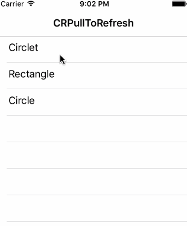

# CocoRongPullToRefresh

*喜欢这个项目？* `点击Star按钮支持我们吧!`

下拉刷新功能应该是所用 app 中使用最频繁的功能了， 这个组件为你的 table view提供了最简单使用方式的下拉刷新特性。

 

### 语言

[English](./README.md)

### 用法

* 下面代码是简单使用这个控件的例子

```swift
tableView.cr.enablePullRefresh {
	    // 调用远程服务器的接口.
        get("http://xxx.com/api/productlist") { dataList in
		// 更新 table view 的数据源
		self.tableView.datasource = dataList
		self.tableView.reloadData()
		// 完成刷新	
		self.tableView.cr.stopRefresh()
	}	
}
```

如你所看到的，我们只要上面几行代码就可以为你的 table view 添加下来刷新功能，如果你想要修改下拉刷新视图的背景颜色，可以参考下面代码：

```swift
tableView.cr.tintColor = UIColor.brown
```

最后，别忘了在view controller 的 `deinit` 方法中调用 `remove()` 方法移除当前页面对 CocoRongPullToRefresh 的引用。

```swift
deinit {
        tableView.cr.remove()
}
```

### 使用示例

下载 example 文件夹下的示例项目查看具体的用法。

### 安装

这里有两种方式添加 `CocoRongPullToRefresh` 到你的项目中。

#### CocoaPods

[CocoaPods](http://www.cocoapods.org) 推荐使用这种方式添加 CocoRongPullToRefresh 到你的项目中.

1. 添加 CocoRongPullToRefresh 到 podfile.

  ```ruby
  pod "CocoRongPullToRefresh", "~> 1.0"
  ```

2. 使用命令 `pod install` 安装所有的库.
3. 引用 CocoRongPullToRefresh： `import CocoRongPullToRefresh `.

#### 手动安装

使用 Terminal.app 运行以下命令:

	$ git clone https://github.com/MellongLau/CocoRongPullToRefresh.git

或者直接下载并拷贝 `CocoRongPullToRefresh` 文件夹和添加引用到你的项目中.

### 要求

Requires Swift 3.0 and iOS 8.0 and ARC.

### 使用 CocoRongPullToRefresh?

如果你在你的项目中使用了 CocoRongPullToRefresh，请发邮件(邮件地址在下面)告诉我一声，我会把你的 app 的下载链接添加到这里！

### 贡献

欢迎为此项目提供任何的帮助，包括意见建议，资金，代码或者精神鼓励等，为此项目贡献代码请提交 pull request, 代码经过审核后会立即合并到主分支中。

### 关于创建者

我是 Mellong, 可以发邮件联系我 E-Mail: <tendencystudio@gmail.com>

个人网站: [http://blog.devlong.com](http://blog.devlong.com)

## 更多

想了解更多? 关注我的 `微信` 公众号 `mellong`:


### License

MIT License